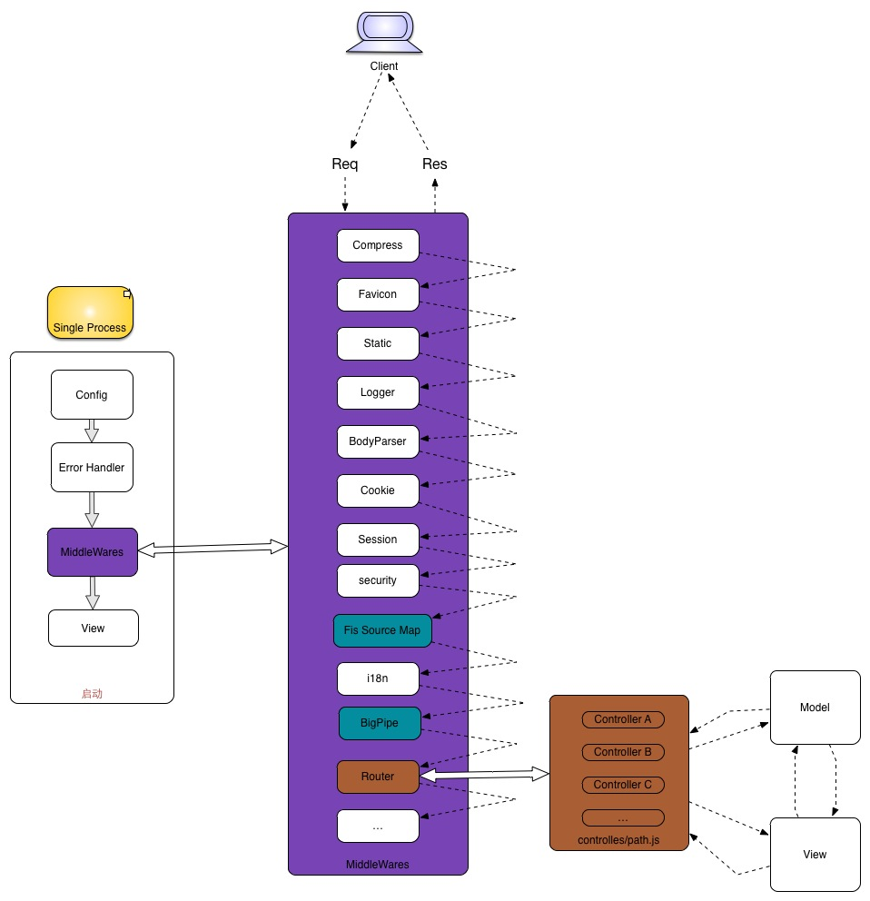

yogurt [ˈjəʊgət]
======================

todo

##  服务端处理流程图



## 目录规范

整体开发分两个流程，前端开发与后端开发。前端开发主要集中在 html 和 js 的编写，所有页面和数据通过 fis 模拟快速提供。后端开发主要集中在数据获取和页面逻辑编写上。

### 前端目录

```bash
├── page                    # 页面 tpl
├── static                  # 静态资源
├── widget                  # 各类组件
├── test                    # 数据与页面模拟目录
├── fis-conf.js             # fis 编译配置
```

### 后端目录

#### app 模块

```bash
├── config                    # 配置文件
│   ├── UI-A-map.json         # 静态资源表。
│   ├── UI-B-map.json         # 静态资源表。
│   ├── config.json           # 默认配置
│   └── development.json      # 开发期配置项，便于调试。
├── controllers               # 控制器
│   └── ...                   # routes
├── locales                   # 多语言
├── models                    # model
│   └── ...
├── public
│   │── UI-A                  # UI-A 的所有静态资源
│   │   └── ...
│   └── UI-B                  # UI-B 的所有静态资源
│       └── ...
├── views
│   │── UI-A                  # UI-A 的模板文件。
│   │   └── ...
│   └── UI-B                  # UI-B 的模板文件。
│       └── ...
└── server.js                 # server 入口
```


### 前后端一体 （！！！备份， 不采用）

```bash
├── config                    # 配置文件
│   ├── config.json           # 默认配置
│   └── development.json      # 开发期配置项，便于调试。
├── controllers               # 控制器
│   ├── development           # 支持 json
│   └── ...                   # routes
├── locales                   # 多语言
├── models                    # model
│   ├── development           # 数据模拟，允许 json 文件直接模拟 model. 
│   └── ...
├── public                    # 静态资源
├── views                     # 模板
├── fis-conf.js               # fis 编译配置
└── app.js                    # server 入口
```

## 模板扩展

基于 [swig](http://paularmstrong.github.io/swig/) 扩展 html、head、body、style、script、require、uri、widget 等标签，方便组织代码和静态资源引用，自动完成 js、css 优化输出。

layout.html

```tpl
<!doctype html>

    
        <meta charset="UTF-8">
        <title></title>
        
        
        
            body { color: white;}
        
        
        
            console.log('hello yogurt');
        
    
    

    
        <div id="wrap">
            
            This will be override.
            
        </div>
    

```

index.html

```tpl



<p>This is just an awesome page.</p>

```

### widget 模块化

页面中通用且独立的小部分可以通过 widget 分离出来，方便维护。

widget/header/header.html

```tpl
<div class="header">
    <ul>
        <li>nav 1</li>
        <li>nav 2</li>
    </ul>
</div>
```

page/index.html

```tpl



    

```

### widget 渲染模式

借鉴了 BigPipe，Quickling 等思路，让 widget 可以以多种模式加载。

1. `sync` 默认就是此模式，直接输出。
2. `quicking` 此类 widget 在输出时，只会输出个壳子，内容由用户自行决定通过 js，另起请求完成填充，包括静态资源加载。
3. `async` 此类 widget 在输出时，也只会输出个壳子，但是内容在 body 输出完后，chunk 输出 js 自动填充。widget 将忽略顺序，谁先准备好，谁先输出。
4. `pipeline` 与 `async` 基本相同，只是它会按顺序输出。

```tpl



    

```

## Fis 静态资源定位

集成在模板引擎中，通过使用扩展的 custom tags 便能正确的资源定位。

## pagelet 管理器

集成在模板引擎中，通过给 widget 设置不同的模式，自动与 pagelet manager 交互，完成功能。

## model 管理器

为了方便 widget 与 model 关联，实现简单通过配置项就能完成的能力，需要一个集中管理 models 的管理器。同时，为了更方便的控制 model 的生命周期，我们也可以通过这个管理器来维护。

```javascript
var user = ModelFactory.get('user', 'session');

user.then(function(val) {
    res.render(tpl, val);
});

user.init();
```

```tpl
...

...
```

如上面 widget 将通过 `pipeline` 方式渲染。 即当框架输出完成后，自动创建名字为 `user`
 的 model，由于 scope="session" 所以同一个 session 期只会创建一个实例。等 model 数据到位再把内容吐出来完成整个 widget 的渲染。其他渲染模式也类似。

 scope 说明

 1. `request` 生命周期为请求期，即没有一个请求都会创建一个 model。
 2. `session` 生命周期为 session。即来自同一个用户，短期内的所有请求只会创建一个 model
 3. `application` 生命周期为整个应用程序的生命周期，即整个 server 从开始到结束只会创建一个 model.

## router

主要起到一个组的概念，将多个路由，按照相同的前缀分类。

比如原来你可能需要这么写。

```javasript
app.get('/user/list', function(req, res, next) {
    // todo
});

app.get('/user/add', function(req, res, next) {
    // todo
});

app.get('/user/edit/:id', function(req, res, next) {
    // todo
});

app.get('/user/read/:id', function(req, res, next) {
    // todo
});
```

此 router 中间件可以让你把 user 操作的一系列路由，组合写在一个 user.js 文件里面，效果与上面代码完全相同。

controllers/user.js

```javascript
module.exports = function(router) {
    router.get('/list', function(req, res, next) {
        // todo
    });

    router.get('/add', function(req, res, next) {
        // todo
    });

    router.get('/edit/:id', function(req, res, next) {
        // todo
    });

    router.get('/read/:id', function(req, res, next) {
        // todo
    });   
};
```

## BigPipe

为了更快速的呈现代码, 可以让页面整体框架先渲染，后续再填充内容。更多请查看[widget 渲染模式](#widget 渲染模式)。

其实对于页面渲染过程中，会拖慢渲染的主要是 model 层数据获取。传统的渲染模式 `res.render(tpl, data)`, 都是先把数据都准备好了才开始渲染，这样其实并没有避开用户等待。

现在的方式是 `res.render()` 只准备框架必要的数据，等框架渲染完后，开始渲染 widget，在渲染之前通过事件与 controller 打交道，补充绑定 widget 的数据, 等数据 ready 再开始完成 widget 渲染。这样便能减少用户的等待时间。

```javascript
router.get('/', function(req, res) {
   
   var frameModel = {
       title: 'xxxx',
       navs: [{}, {}]
    }

    req.bigpipe
        .bindSource('pageletId', function( done ) {
            // 此方法会在 widget 在渲染前触发。
            // widget 可能会在 body 输出完后渲染，
            // 也可能会在下次请求的时候开始渲染。

            var user = new User();
        
            user.fetch();

            user.then(function( value ) {
                done( value );
            });
        })
        .render('user.tpl', frameModel);
});
```


